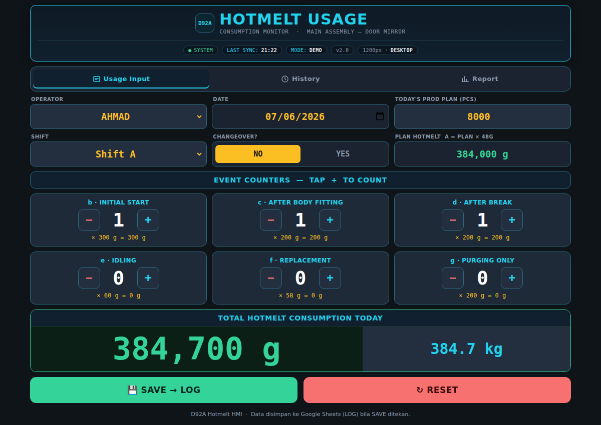
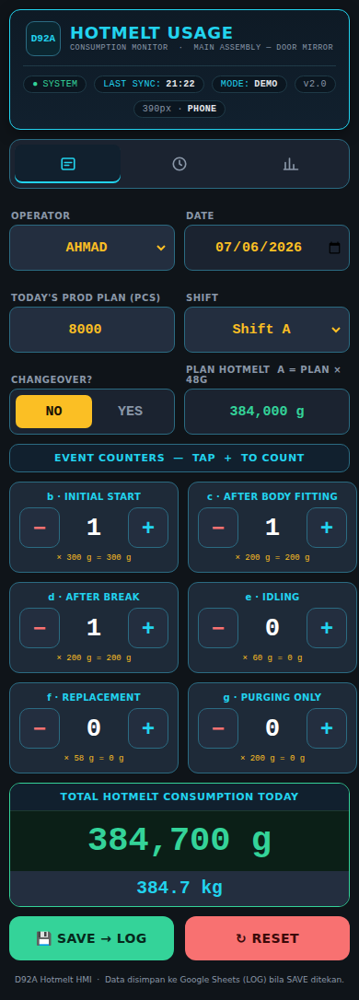
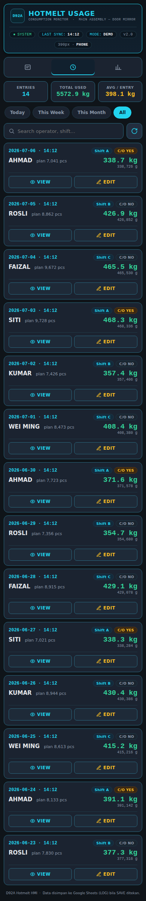
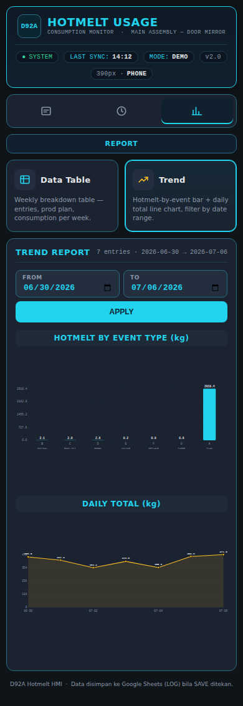
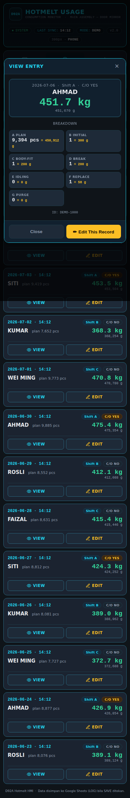
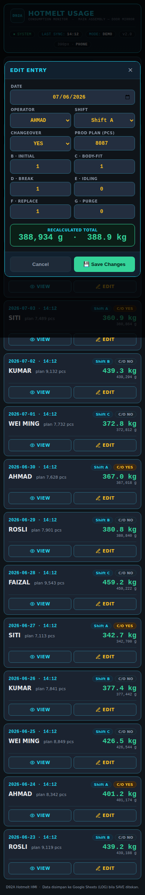
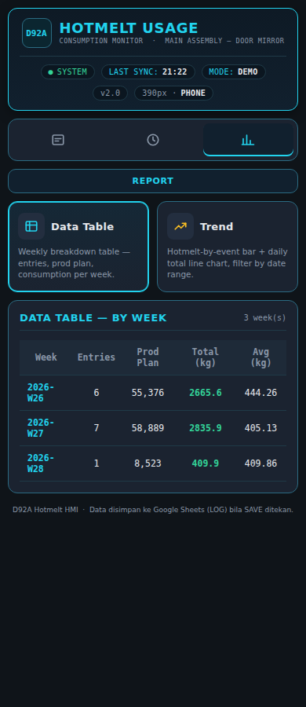

# D92A Hotmelt Usage — Digital HMI Tracker

> Mobile-first HMI-style web app for tracking hotmelt glue consumption on the **D92A door mirror assembly line**. Digitizes the paper-based check sheet, saves entries to Google Sheets in real time, and generates weekly reports & trends — all without a database, server, or paid infrastructure.



<p align="center">
  
  
  
  
  
</p>

---

## 🎯 Purpose

Manual check sheet `PGE-GE-D92A-HOTMELT` requires operator to tally hotmelt glue usage per shift across 6 event types (Initial Start, After Body Fitting, After Break, Idling, Replacement, Purging). Paper-based, hard to consolidate, no historical view.

This app replaces that with a **touch-friendly digital tracker** — scan QR at line, tap counters, hit SAVE. All data flows into Google Sheets automatically, with dashboards and weekly trend reports out of the box.

## ✨ Features

- **3-tab HMI layout** — Input · History · Report
- **Real-time save** to Google Sheets via Apps Script Web App
- **View & Edit** existing records (correction workflow) with popup modal
- **Weekly Data Table** — aggregate by ISO week
- **Trend Charts** — Bar chart (kg per event type) + Line chart (daily total) with date-range picker
- **Mobile-first** responsive design (2-up phone, 3-up tablet/desktop)
- **Filter chips** — Today · Week · Month · All
- **Search** by operator or shift
- **Demo mode** — works without API URL for testing
- **Server-side compute** — total gram calculated on Apps Script, not front-end (single source of truth)

## 📸 Screenshots

| Usage Input | History | Report Trend |
|---|---|---|
|  |  |  |

| View Modal | Edit Modal | Data Table |
|---|---|---|
|  |  |  |

## 🏗 Architecture

```
   ┌─────────────────┐          ┌──────────────────┐         ┌────────────────┐
   │  Phone / Tablet │  ──POST──▶│ Apps Script      │──write──▶│ Google Sheets │
   │  (GitHub Pages) │  ◀──JSON──│ /exec Web App    │◀─read───│  (LOG sheet)  │
   │                 │           │                  │         │                │
   │  index.html     │           │  Code.gs         │         │  Records      │
   │  · Input tab    │           │  · doGet(list)   │         │                │
   │  · History      │           │  · doPost create │         │                │
   │  · Report       │           │  · doPost update │         │                │
   └─────────────────┘           └──────────────────┘         └────────────────┘
```

**Data flow:** Operator taps `+` counters → tekan SAVE → `fetch()` POST payload to Apps Script `/exec` → server computes total gram → appends row to `LOG` sheet → returns success → app refreshes history.

## 🚀 Quick Start

### 1. Create Google Sheet
- Buka `sheets.new` → nama "D92A Hotmelt Usage"

### 2. Deploy backend (Apps Script)
- Sheet menu: **Extensions → Apps Script**
- Padam kod default → paste **[apps-script/Code.gs](apps-script/Code.gs)** → **Save**
- **Deploy → New deployment → Web app**
  - Execute as: **Me**
  - Who has access: **Anyone**
- Copy the `/exec` URL

### 3. Set API URL
- Edit **[index.html](index.html)** → cari `const API_URL = '';`
- Paste `/exec` URL: `const API_URL = 'https://script.google.com/.../exec';`

### 4. Deploy frontend (GitHub Pages)
- Upload `index.html` to repo root (file kena nama `index.html`)
- Repo **Settings → Pages** → Source: **Deploy from a branch** → Branch: **main** → **/(root)** → Save
- Site live at `https://<username>.github.io/<repo>/`

📖 **Step-by-step with gotchas**: see **[docs/SETUP.md](docs/SETUP.md)**

## 📊 Data Schema

The `LOG` sheet stores one row per entry with 16 columns (ID, Timestamp, Date, Operator, Shift, Changeover, ProdPlan, 6 event counters, PlanG, TotalG, TotalKg).

📖 Detailed schema: **[docs/DATA-SCHEMA.md](docs/DATA-SCHEMA.md)**

## 🔌 API Endpoints

The Apps Script Web App exposes 3 operations on a single `/exec` URL:

| Method | Payload | Purpose |
|---|---|---|
| `GET ?action=list` | — | Fetch all records as JSON array |
| `POST` (no action) | `{date, op, shift, co, plan, b, c, d, e, f, g}` | Create new entry |
| `POST action=update` | `{action:'update', id, ...same fields}` | Update existing entry by ID |

All responses: `{ok: true/false, id?, totalG?, totalKg?, error?}`

## 🛠 Tech Stack

- **Frontend**: Vanilla HTML/CSS/JS (no framework, no build step)
- **Charts**: Custom inline SVG (no chart library, ~2 KB)
- **Icons**: Inline SVG (Lucide-style, no CDN)
- **Backend**: Google Apps Script (JavaScript runtime)
- **Data store**: Google Sheets
- **Hosting**: GitHub Pages (frontend) + Apps Script Web App (backend)
- **Cost**: **RM 0.00** — everything on free tiers

## 🎨 Customization

Common tweaks — edit these constants in `index.html`:

```js
const WEIGHTS = { plan:48, b:300, c:200, d:200, e:60, f:58, g:200 };
```
Change hotmelt weights (grams per count/pcs).

```js
<option>AHMAD</option><option>ROSLI</option>...
```
Add/remove operator names — same list appears in Edit modal.

```js
const DEFAULTS = { b:1, c:1, d:1, e:0, f:0, g:0 };
```
Default counter values on RESET.

⚠️ Kalau ubah `WEIGHTS`, ubah juga dalam **`Code.gs`** untuk kekalkan konsistensi antara front-end dan backend.

## 🐞 Troubleshooting

| Problem | Fix |
|---|---|
| 404 on GitHub Pages root URL | Rename file to `index.html` (root URLs require this filename) |
| Update to `Code.gs` tak effect | Apps Script → **Manage deployments → Edit → Version: New version → Deploy** |
| `SecurityError` on `replaceState` in preview | Normal in sandboxed iframes — will disappear once deployed to real domain |
| CORS error on POST | Do **not** set `Content-Type: application/json` header — leave it default |
| Data hilang lepas edit Code.gs | Existing records in `LOG` sheet tak terjejas; hanya kod yang berubah |
| App tak load kat phone | Pastikan repo Public — deploy from branch tak boleh untuk private repo free plan |

## 📁 Repo Structure

```
d92a-hotmelt/
├── index.html                # Main webapp (deploys to GitHub Pages)
├── apps-script/
│   └── Code.gs               # Backend to paste into Apps Script editor
├── docs/
│   ├── SETUP.md              # Detailed setup walkthrough
│   ├── DATA-SCHEMA.md        # LOG sheet column reference
│   └── screenshots/          # UI screenshots for README
├── README.md                 # This file
├── LICENSE                   # MIT
├── CHANGELOG.md              # Version history
└── .gitignore
```

## 🗓 Version

**v2.0** — Current release: 3 tabs, View/Edit modals, weekly trend charts with date range.
See **[CHANGELOG.md](CHANGELOG.md)** for release history.

## 📝 License

MIT — see **[LICENSE](LICENSE)**. Free to fork, adapt for other production lines (e.g., different weights, different event codes).

## 👤 Author

**Zulfikri Yacob**
Senior Manufacturing Quality Engineer · Armstrong Auto Parts Sdn. Bhd. · Honda Lock Division

Built as part of ongoing initiative to digitize paper-based quality tracking on the D92A line.

---

<sub>🔧 Part of a wider stack of digital tools — Consumable Stock Tracker, Door Mirror Inspection App, Attendance Survey — all built on the same Vanilla JS + Apps Script + Google Sheets pattern.</sub>
